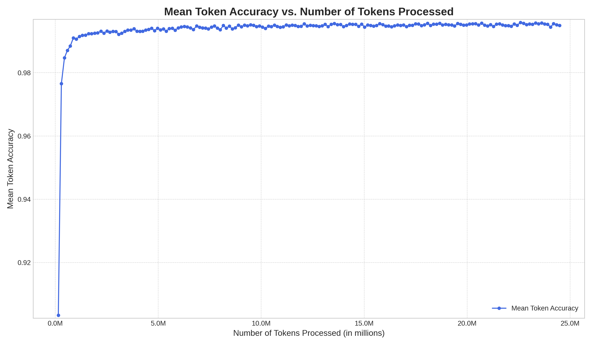
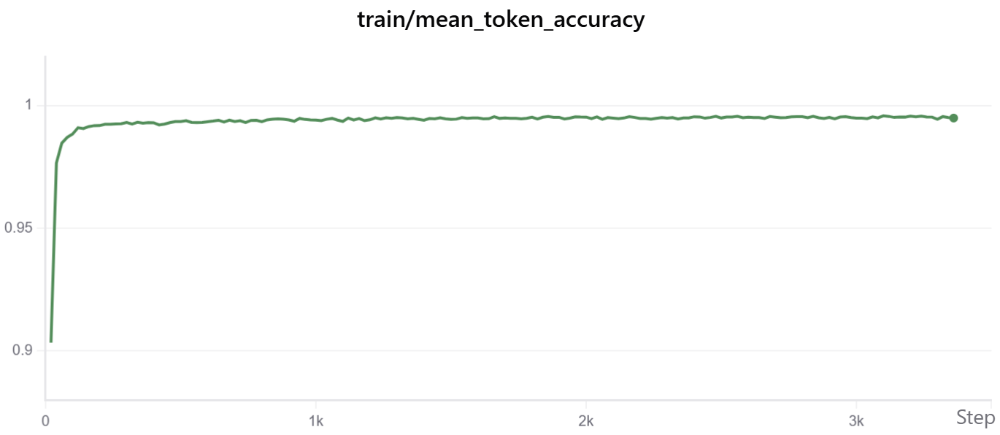
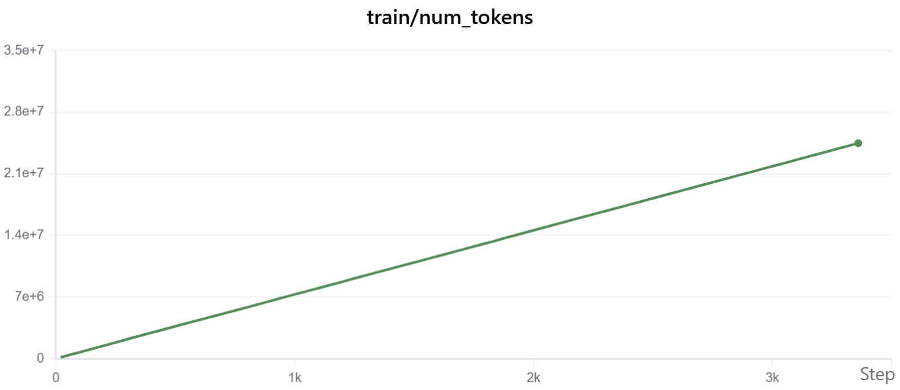

# 24点游戏大模型求解器 (Chain-of-Thought)

本项目旨在训练一个能够解决经典数学游戏“24点”的大语言模型。与传统的穷举搜索算法不同，本项目通过**思维链（Chain-of-Thought, CoT）**技术，让模型模仿人类的思考过程，展示其推理、尝试、甚至“犯错后纠正”的能力，最终给出解法或判断无解。

本项目核心是使用 `Qwen3-0.6B` 模型，在一个精心构造的、包含详细思考过程的24点游戏数据集上进行微调（SFT）。

## ✨ 项目功能

*   **高质量思维链数据集**：`generate_dataset.py` 脚本能够生成包含**整数解**、**小数解**和**无解**三种情况的24点题目，并为每道题生成了详尽的、人性化的思考过程。
*   **高效模型微调**：使用 `trl` 库的 `SFTTrainer`，结合 DeepSpeed ZeRO-2 和 Flash Attention 2 等技术，实现高效的模型训练。
*   **实验跟踪**：集成了 SwanLab 回调，可以轻松记录和可视化训练过程中的各项指标。
*   **完整的解决方案**：提供了从数据生成、模型训练到最终推理的完整代码。

## 📂 项目结构

```
.
├── datasets/              # 生成的数据集存放目录
├── model/                 # 存放基础模型（如 Qwen3-0.6B）
├── results/               # 训练输出，包含 checkpoints
├── swanlog/               # SwanLab 日志目录
├── generate_dataset.py    # 24点游戏思维链数据集生成脚本
├── train.py               # 模型微调训练脚本
├── infer.py               # 使用训练好的模型进行推理的脚本
├── sft.sh                 # 启动训练的Shell脚本
├── deepspeed_zero2.json   # DeepSpeed 配置文件
├── pyproject.toml         # 项目依赖与配置
└── README.md              # 本文档
```

## 🚀 快速开始

### 1. 环境配置

首先，克隆本仓库到本地：
```bash
git clone https://github.com/Tensionteng/twenty-four-point-game.git
cd twenty-four-point-game
```

建议使用虚拟环境。本项目使用 `uv` 作为包管理工具，你可以通过 `pip` 安装它：
```bash
pip install uv
或者
curl -LsSf https://astral.sh/uv/install.sh | sh
```

然后，在项目根目录下使用 `uv` 安装所有依赖：
```bash
uv sync
uv add flash-attn --no-build-isolation
```
*注意：`flash-attn` 的安装可能需要特定的CUDA环境，请参考其官方文档。*

### 2. 准备工作

**a. 下载基础模型**

你需要从 Hugging Face 或 ModelScope 下载 `Qwen3-0.6B` 模型，并将其放置在 `model/` 目录下，最终路径应为 `model/Qwen3-0.6B`。

**b. 生成数据集**

运行以下命令生成训练、验证和测试所需的数据集：
```bash
python generate_dataset.py
```
脚本执行完毕后，你会在 `datasets/` 目录下看到生成的数据文件。

注意：
1. 生成数据的脚本是基于一定的随机性，每次运行可能会生成不同的数据集。而且不是很完善，完全穷举生成的思维链长度达到24K，普通GPU无法运行，所以我修改了生成的逻辑，用启发式的思维链生成方式，生成的思维链长度大概在0.5K左右。可自行修改。`generate_dataset.py`脚本以满足不同需求。
2. 因为脚本设置的数据范围是1-13，所以生成的数目是有理论上限的，无法生成足够多的数据。

数据集包含三种类型的题目：
*   **整数解（1400条）**：题目有整数解法，模型需要通过思维链找到解。
*   **小数解（0条，太难搜到了，建议直接构造数据）**：题目只有小数解法，模型需要展示其推理过程并给出小数解。
*   **无解（450条）**：题目无解，模型需要通过尝试和推理，最终判断无解。

通过实验发现，在生成1470个整数解之后，很难再生成新的解（暴力搜索60w+次），无解数据上限在470左右，小数解跑了10分钟没搜出一个，放弃了。

### 3. 模型训练

本项目使用 DeepSpeed 进行分布式训练。`sft.sh` 脚本已经为你配置好了启动命令。

首先，根据你的环境修改 `sft.sh` 中的 `CUDA_VISIBLE_DEVICES` 来指定使用的GPU。例如，使用 GPU 0 和 1：
```bash
export CUDA_VISIBLE_DEVICES=0,1
```

然后，运行脚本开始训练：
```bash
bash sft.sh
```
训练日志会同时输出到终端和 `sft.log` 文件中。训练过程中的模型检查点（checkpoints）会保存在 `results/` 目录下。

### 4. 模型推理

训练完成后，你可以使用 `infer.py` 脚本来测试模型的效果。

打开 `infer.py` 文件，修改 `model` 变量为你想要测试的 checkpoint 路径，例如：
```python
model = "results/checkpoint-321"  # 替换为你的checkpoint路径
```
同时，你也可以修改 `question` 变量来测试不同的题目。

然后运行脚本：
```bash
python infer.py
```
你将看到模型生成的包含完整思考过程的答案。

## 🔧 主要依赖

本项目基于以下核心库：

*   `torch`
*   `transformers`
*   `datasets`
*   `trl` (Transformer Reinforcement Learning)
*   `deepspeed`
*   `flash-attn`
*   `swanlab`

详细依赖请见 `pyproject.toml` 文件。

## 📊 训练指标

以下是本次 `Qwen3-0.6B` 模型在24点游戏CoT数据集上SFT训练过程中的一些关键指标。

### Token准确率 vs. 处理的Token数

这张图表展示了模型的Token预测准确率随着训练过程中处理的总Token数量增加而变化的情况。可以看出，随着模型学习更多的Token，其准确率迅速提升并稳定在一个高水平。



### 训练损失

训练损失（Train Loss）的变化情况。


### 平均Token准确率

每个评估步骤的平均Token准确率。



### 处理的Token数量

训练过程中处理的Token总数。


